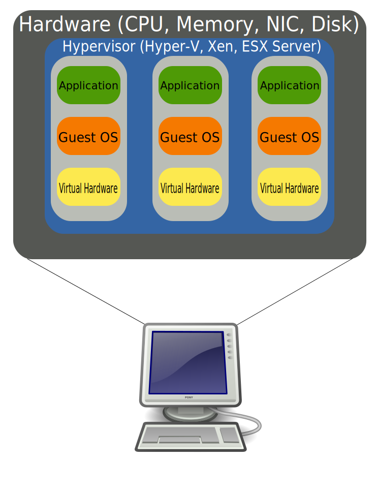
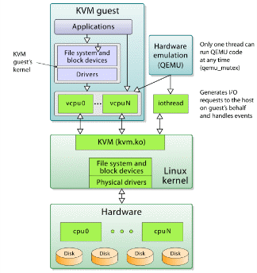

# VMs-quickstarts
VMs (Virtual Machines) quickstarts!

## A Brief History of Virtualization
- 1960's - Used by mainframes and made by IBM (programmer behind it was Jim Rymarczyk). The name was CP-67 and was running on System/360-67. The OS CP/CMS was a time-sharing OS.
    - It is now used in the z/VM in the mainframe market
- 1972 - CP-40 was the replacement for CP-67 in that year it became an IBM product as hypervisor (UNIX is an example of virtualization at the end user level it will give you a good step towards application virtualization).
- 1990 - Sun Microsystems started a project called "Stealth". For better writting and running a applications
- 1995 - It was renamed to Java is able to run on many types of computers OSs and with a rich set of applications. Java let devs write code that could run on multiple OSs. All you need is to run the JRE to have your Java run. JRE contains many things like Java Virtual Machine. All Java apps run in the JVM. The JVM can be considered a small OS. For more details: https://en.wikipedia.org/wiki/Timeline_of_Virtualization_development%E2%80%9D
- 2003 - Ian Pratt co-founded XenSource and the first version of Xen was release (based on a research project from Ian Pratt and Simon Crosby at University of Cambridge)
- 2005-2006 - Intel and AMD introduced limited hardware virtualization with Intel (VT-x) and AMD (AMD-V)
- 2007 - Citrix bought XenSource, Inc
- 2008 - RedHat acquired KVM
- 2013 - Xen project moved to the auspices of the Linux Foundation and “Xen” changed to “Xen Project” (now Amazon, AMD, Cisco, Citrix, Intel, Oracle and more support the Project)

## What is virtualization? And why?
- Instead of leaving a lot of hardware unused and let it go to waste you can use virtualization

## Types of Virtualization
- **Client Virtualization** - Refers to virtualization on a desktop or laptop computer. OS virt means the movement of the main desktop OS in a virtual env. The OS can be changed and modified without affecting other users.
    - **Containers** - Can help with moving apps from one computer to another environment. The Kernel runs on the hardware with several isolated guest virtual machines. Popular ones Podman, Docker, VagrantUp and LXC. They help with performance and overhead. Security is a challange but easy to use.
- **Server Virtualization** - Means moving a physical server to a virtual env. This type helps reduce the number of physical servers. Equals to more control over their growing server farms. Benefits: you can reboot a machine without affecting the other ones, you can have different OSs.
- **Storage Virtualization**
    - Combining multiple physical HDDs into a single virtualized storage
    - Synonyme: Cloud Computing
    - Better functionality and features
    - Help with: backup, archiving and recovery
    - It can be private, public or mixed
        - Private: hosted in the company
        - Public: out of your company like “DropBox”, “Microsoft One Drive”, “Amazon S3”
        - Mixed: environment is a combination of both
    - Data is stored in a logical pools and physical storage
- **Hardware Virtualization**
    - Real machine components made virtual
    - Synonym: platform virtualization (creating a VM that behaves like a real computer with an OS)
    - The virtualization hides the hardware from resources that the software cannot see
    - If you run Windows OS on linux with this type of VM it won't know it is in a VM
    - Sub-types: 
        - Full Virtualization: Simulation of hardware
        - Partial Virtualization: Simulation of mutiple instances of hardware. Not all of the OS is running on the VM. It is important for space constraints.
        - ParaVirtualization: No need for hardware virtualization. Special API is offered to modify the guest OS. The OS needs to be modifiable so the Source Code needs to be accessible for this type. This tech was introduce by Xen Project team. Also useful because you won't need to virtualize an extensions on the host CPU. Also useful for hardware that does not support hardware-assisted virtualization.

## Virtualization and Security
- Isolate the VM from the Host
- Virtualization adds additional layers of complexity and therefore monitoring and finding security vulnerabilities becomes more difficult (means also that a hacker has more work to do to understand the environment)
- A virtualized network is isolated from other virtual networks and physical networks
    - For this to work the isolation cannot require firewall, ACLs and...
- Traffic in between hypervisors are encapsulated and the physical network operates in a different address space
    - Example of it is that networks can be IPv6 and virtual networks can be IPv4 or vice versa
- Network Segmentation: split a computer network into subnetworks and make each of them a network segment (implemented by a hypervisor switch or OpenvSwitch)
    - Better performance
    - Better security
        - Segmentation provides a good control for limit access to the network

> Security can be broken by bad configurations.
>
> Example: a bunch of open ports!

### Sandbox
- Examples: 
    - SELinux
    - Apparmor
    - Virtual machine
    - JVM
    - Features in browser like Chromium
    - Sandboxie
        - Developed by the Invincea Windows OS
        - It allows users to run and install applications without modifying your drive
    - http://www.sandboxie.com/
    - Linux version: https://pdos.csail.mit.edu/archive/mbox/

> Over time hackers have found ways arround sandboxing.
>
> Example: [Paranoid Fish](https://github.com/a0rtega/pafish)

### Containers vs Virtualization
Mostly about containers.
- Also known as: Operating-system-level virtualization
- It's been around for a a while but Docker, Vagrantup and LXC have made it more pop

Little history on Docker: 
> *In 2004, Docker teamed up with companies like Canonical, Google, Red Hat and Parallels to create a standard that allows containers to work within Linux namespaces and control groups without any admin access and offer a better interface for all Linux Distro. This allows many containers to run in a single VM.*

Advantages: 
- Containers don't need some much overhead because the containers share the OS Kernel
- It makes applications running in containers more portable since you transfer an image of your container with the application so no issues with missmatching libraries or something
- Containers start faster than VMs

Disavantages: 
- Security is not as good compared to a VM because it shares Kernel hooks
- If Kernel vern. exists than it easy for a hacker to hack into the host system and other containers

Tool to test security of containers: https://github.com/coreos/clair

Other resources: 
- http://www.cvedetails.com/product/28125/Docker-Docker.html?vendor_id=13534
- https://www.blackhat.com/docs/eu-15/materials/eu-15-Bettini-Vulnerability-Exploitation-In-Docker-Container-Environments-wp.pdf

Five security concerns with Docker: 
1. Kernel exploits
2. Denial-of-service attacks
3. Container breakouts
4. Poisoned images
5. Compromising secrets

> Also to note that SELinux is very useful for the security of containers. When you let the container access a volume on your system it can then travel trough the rest of the system especially if it is running as root. So use SELinux for better access control and security.

### Linux Virtualization
> Performance benchmarks: https://major.io/2014/06/22/performance-benchmarks-kvm-vs-xen/
#### Xen
- Xen Project manages hardware for all Virtual Machines and the most privileged domain
- Domains == VMs in Xen
- Privileged domain as dom0
- dom0 is the only one that has direct access to the hardware
- dom0 can be Linux or BSD
- The domains any OS like Linux, BSD, Microsoft Windows, etc
- Xen dom0 and domU have support in the Linux Kernel since version 3.0
- Live migration are supported
- Sload balancing that prevents downtime, is also supported
- Here are the fives types of vistualization that Xen supports: 
    - HVM
    - HVM with PV drivers
    - PVHVM
    - PVH
    - Paravirtualization

#### KVM
- Kernel-based Virtual Machine
- Turns the kernel into a hypervisor
- It needs a CPU that supports hardware virtualization (e.g.: Intel VT-x or AMD-V)
- Linux Kernel acts as a hosted hypervisor (Type 2 Hypervisor)
- Virtual Machine manager that is installed as a software on an existing OS
- KVM creates a VM and coordinates hardware equipment via the host OS for the VM
- It supports many OSs: Microsoft Windows, Linux, Mac OS X
- Modified version of QEMU can run Mac OS X
- No emulation
- Uses `/dev/kvm` interface that a is a userspace for:
    - Setup address space for guest VM
    - Creating a Virtual Machine
    - Reading and writing VCPU registers
    - Inject and interrupt into a VCPU
    - Running a VCPU
- For BIOS it uses: SeaBIOS
- SeaBIOS: 16-bit x86 BIOS that support standard BIOS features
- Benfits: 
    - **security**: Compatibale with SELinux (Mandatory Access Control security between virtual machines)
    - **QoS**: Administrator can define thresholds for CPU, Memory and better guarantee QoS for VMs
    - **Open Source**
    - Full virtualization and near-native performance
- Disadvantage: 
    - Complex Networking
    - Limited Processors
    - CPU Virtualization Support

##### KVM Architecture:

#### OpenVZ
- Open Virtuozzo
- Operating system-level virtualization in Linux
- Run multiple isolated OSes on a server
- Similar to container like LXC
- Cannot prepare full virtualization like Xen
- Can **only run** Linux
- OpenVZ shares the same architecture and Kernel version
- OpenVZ Virtual Machines are jailed containers and are not true VMs
- In the past the file system was isolated with *chroot* but now it has its own FS
- Advantage: Memory allocation is soft (means the memory cannot be used by others)
- OpenVZ is often called virtual private servers (VPSs)
- 

## Resources
- [1 - Chapter | HelloXenProject | Book | Wiki | Xen Project](https://wiki.xenproject.org/wiki/Book/HelloXenProject/1-Chapter)
- [XCP-NG vs Xen vs XenServer vs KVM vs Proxmox | YouTube](https://www.youtube.com/watch?v=yulfCYmliX8)
- [How to create your own virtual machine | codeproject](https://www.codeproject.com/Articles/43176/How-to-create-your-own-virtual-machine)
- [Hypervisor](https://en.wikipedia.org/wiki/Hypervisor)
