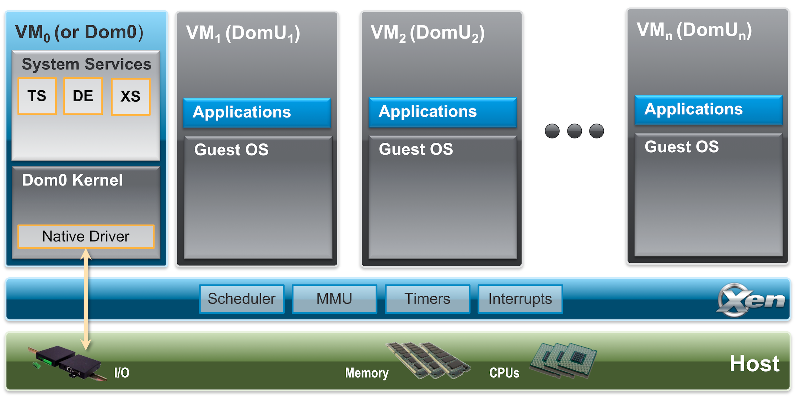

# Xen | VMs QuickStarts
- Xen != Xenserver - The XenServer is now called Critix Hypervisor and is a commericla version from Critix
- Xen is backed by the Linux Foundation
- Xenserver is downstream of Xen and the same for XCP-ng is also downstream to Xen. XCP-ng is **not** downstream from Xenserver
- Over 10+ million people use Xen around the world + 2000+ commercial certified partners
- The license is GPLv2 AWS benefits from this because they have built tools arround Xen without needing to Open Source them (toolstacks)
- AWS is **NOT** replacing their Xen stack with KVM
- Xen is ~2% of the Linux code
    - As a true hypervisor type-1 you boot your hardware on Xen. Xen is similar to a micro-kernel (benefits: the attack surface is **REALLY** low!)
    - Since there is not that much code you can read it and understand it. Great way to learn what a hypervisor is and how it works and mover foward to improving it
    - You can contribute to it easily compared to KVM/Linux because the contributions are more trusted from Google, IBM and the like
- Critix and Vates invest a lot into Xen
- Proxmox vs XCP-ng - 

- Xen project is [type-1 hypervisor](http://en.wikipedia.org/wiki/Hypervisor)
- Multiple instances of an OS (other types in parallel) can be run at the same time
- Used for: 
    - server virtualization
    - Infrastructure as a Service (IaaS)
    - desktop virtualization
    - security applications
    - embedded
    - hardware appliances
- OS agnostic 

### Key features
- Footprint and interface are small (~1MB in size) - Microkernel design (reason why it is small)
- OS agnostic - dom0 is normaly Linux but it can also be NetBSD or OpenSolaris
- Driver Isolation - In the event that a driver crashes or is compromised it will only happen in the VM that uses it so that the other VMs are not affected
- Paravirtualization - Fully paravirtualized guests have been optimized to run as a virtual machine. This means that the guests will run faster than with hardware extensions (HVM). It also means that it can run on hardware that doesn't support virtualization extensions.

## Xen Project Architecture

- Xen Project runs directly on the hardware
- Responsible for handling: 
    - CPU
    - Memory
    - timers
    - interrupts
- It runs just after the bootloader before anything else
- VMs run on top of the hypervisor
- A VM instance is called: 
    - domain
    - guest
- domain 0 (dom0) contains: 
    - drivers for all the devices in the system
    - control stack
    - other system services to manage a Xen based system

> It is possible to break from this "*normal*" setup.
>
> Throught [Dom0 Disaggregation](https://wiki.xenproject.org/wiki/Dom0_Disaggregation) it is possible to run **some** of these services/drivers in a seperate VM.

- Hypervisor itself has no knowledge of I/O functions such as networking and storage 

## Resources

## Credits
- https://wiki.xenproject.org/wiki/File:Xen_Arch_Diagram_v2.png
